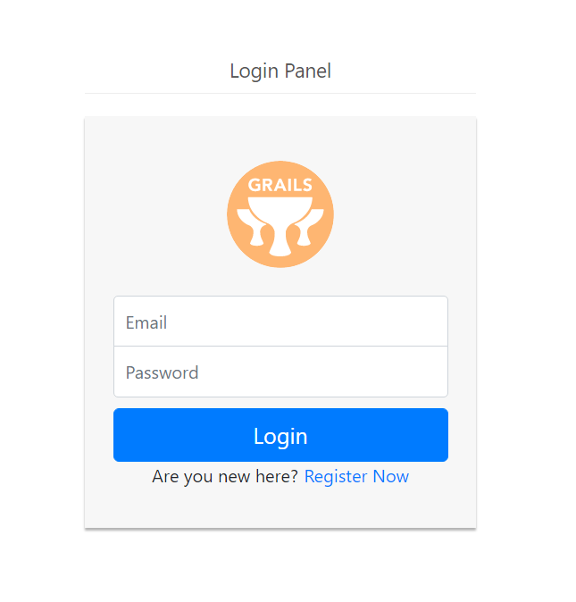
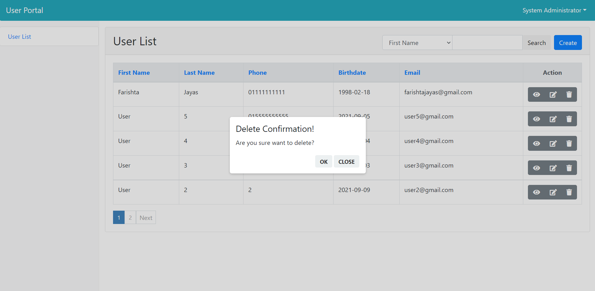
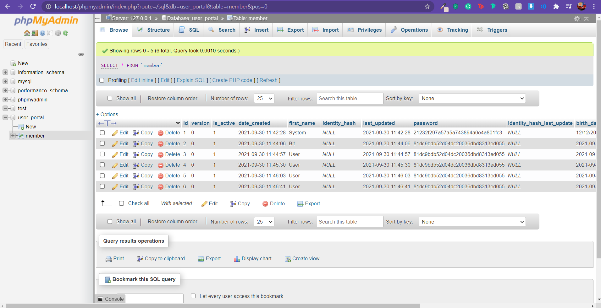

# User Portal 
Simple  portal where users can sign up and login.

## Tech Stack
    - Grails
    - MySQL

### Super Admin Details
    Username: admin@localhost.com
    Password: admin

* SQL file can be found in the "sql_file" folder

### Todo
    - Add Ajax email validation
    - Ajax user Search

